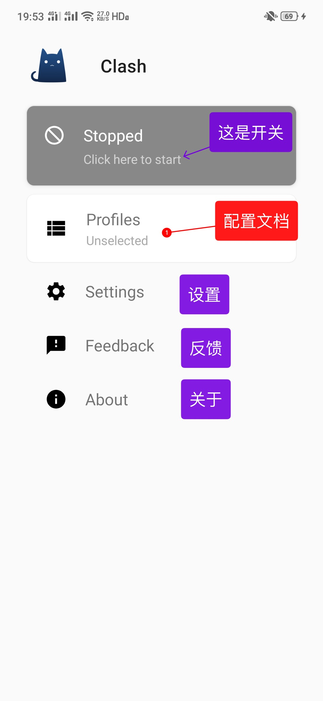
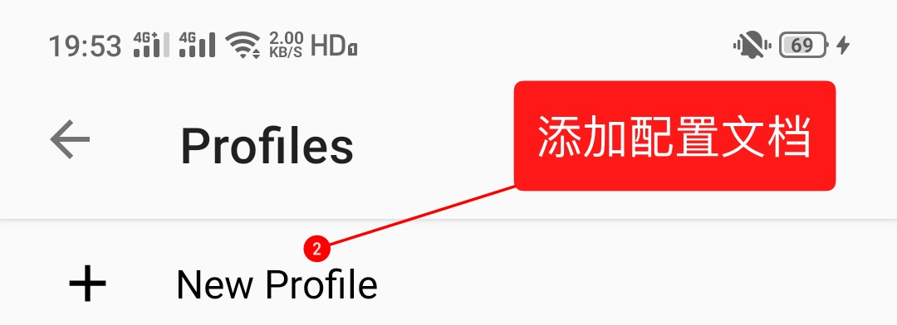
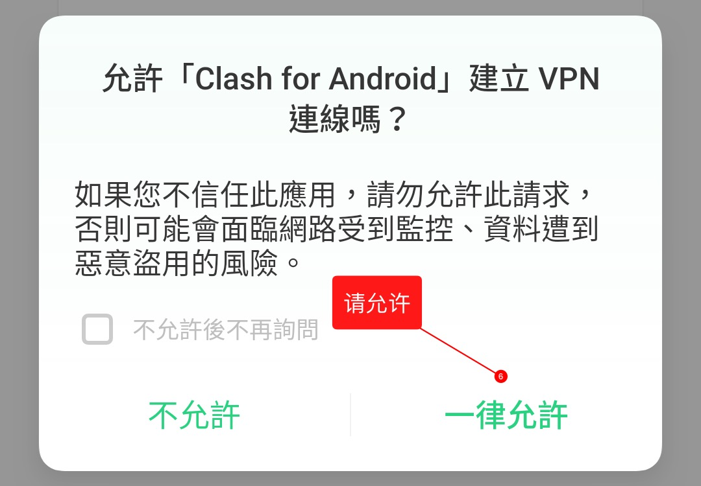

# ClashA


**如果您是免费用户请注意：**免费用户仅能使用SSR，不支持本软件！



**安卓用户请注意！！**使用国产/自带浏览器可能会出现菜单无法展开，软件无法下载等BUG，建议使用**Chrome**浏览器打开本页面！


## 前言


在使用本站服务前，我们建议您保存好本站的联系方式，以防止与我们失联。


1. 地址发布页，建议收藏！地址：[http://bytelink.pro](http://bytelink.pro)
2. TG频道：[点击关注](https://t.me/bytelink) （TG是一个国外通讯软件，需要翻墙，具体的教程[在这里](../../advanced/telegram.md)！\)
3. TG群：TG群仅允许VIP会员加入，购买会员后，在用户中心的用户须知可见！

## 下载

[点击这里进入](https://github.com/ccg2018/ClashA/releases)Github项目页，下载安装文件（.apk）


Android 10用户请注意：上方地址的版本不支持10系统。官方发布了一个内测版本（beta4）支持但是还没有发布，我们提供下载链接，不确保完全稳定性。

[点击这里进入下载页](https://www.lanzous.com/i6uthhe)


## 对比传统SSR优势

* 拥有自动选择/切换节点功能；
* 自带的规则对比SSR的PAC或自带规则更为完善，减少误判；
* 可针对不同网站自动选择不同节点；
* 可以使用Adblock规则去广告（默认已开启）。

## 配置

1.前往订阅中心，到**Clash托管**处点击 “复制链接”


托管链接获取教程请[点击这里](../../panel.md#ding-yue-tuo-guan-lian-jie)


2.复制好了 Clash 订阅之后打开 Clash for Android 应用程序。请点击 Profiles 。

3.请在新弹出的窗口中点击 + New Profile 。

4.请点击 URL 导入，并粘贴您的 Clash 订阅链接。然后点击选中自己的配置。

配置文档备注名右侧是刷新按钮。服务器信息可能会不定时更新，若出现大面积节点超时现象，可尝试刷新订阅。

返回首页。点击开关，即可进行代理。会提示是否同意创建VPN，请点击允许。

开启代理后，可以点击 Proxy 选项卡，进入策略组面板，在这里可以切换节点。直接点击你想要的节点即可进行切换。


这里还有很多选项，包括Domestic，Others，Adblock等等。这些属于策略组，如果您感兴趣，可以[点击这里](../../advanced/rules.md)查看相关教程。请勿在看教程之前随意修改，否则可能出现问题！



此时您已经可以正常访问国际互联网了


5.此后您可再次点击DASHBOARD进入此界面以随时调整配置。

## 其它

我们目前不确定 ClashA 能否自动更新配置，如节点列表有更新（或您修改了密码），您可以手动更新配置。即按照以上步骤重新导入托管链接并下载。

